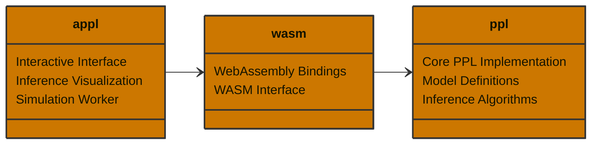

# SchemePPL

A mini probabilistic programming language that combines the elegance of Scheme's syntax with Bayesian inference capabilities. It allows you to define probabilistic models using a simple, Lisp-like syntax and perform inference using Markov Chain Monte Carlo (MCMC) methods.

In addition, there is an application for visualizing the inference process of a Random Walk Metropolis-Hastings algorithm:

- https://appl-ten.vercel.app

## Features

- Scheme-like DSL for model specification
- Built-in support for basic probability distributions
- MCMC-based inference (Random Walk Metropolis-Hastings)
- Support for mixture models and complex probabilistic relationships
- Web-based interface for model visualization and interaction

## Example

Here's an example of a Gaussian mixture model implemented in schemeppl:

```rust
use std::sync::{Arc, Mutex};

use rand::distributions::{Bernoulli, Distribution};
use rand::rngs::StdRng;
use rand::SeedableRng;
use statrs::distribution::Normal;

use ppl::dsl::Value;
use ppl::inference::metropolis_hastings_with_proposal;
use ppl::utils::compute_mean_and_variance;
use ppl::{r#gen, r#sym};

// Constants
const SEED: u64 = 42;
const BURN_IN: usize = 100;
const DRAW: usize = 1000;
const STEP_SIZE: f64 = 0.15;
const NUM_SAMPLES: usize = 500;

// Run the inference for a univariate GMM model
fn main() {
    // Generate data
    let rng = Arc::new(Mutex::new(StdRng::seed_from_u64(SEED)));

    let p = 0.5;
    let (mu1, mu2) = (-2.0, 2.0);
    let sigma = 1.0;

    let z_dist = Bernoulli::new(p).unwrap();
    let z: Vec<bool> = (0..NUM_SAMPLES)
        .map(|_| z_dist.sample(&mut *rng.lock().unwrap()))
        .collect();

    let component1 = Normal::new(mu1, sigma).unwrap();
    let c1: Vec<f64> = (0..NUM_SAMPLES)
        .map(|_| component1.sample(&mut *rng.lock().unwrap()))
        .collect();

    let component2 = Normal::new(mu2, sigma).unwrap();
    let c2: Vec<f64> = (0..NUM_SAMPLES)
        .map(|_| component2.sample(&mut *rng.lock().unwrap()))
        .collect();

    let data = Value::List(
        (0..NUM_SAMPLES)
            .map(|i| if z[i] { c1[i] } else { c2[i] })
            .into_iter()
            .map(|x| Value::Float(x))
            .collect(),
    );

    // Model Specification
    let model = gen!([data] {
        // Priors
        (sample mu1 (normal 0.0 1.0))
        (sample mu2 (normal 0.0 1.0))

        // Ordering
        (constrain (< mu1 mu2))

        // Mixture
        (define p 0.5)
        (define mix (mixture (list (normal mu1 1.0) (normal mu2 1.0)) (list p (- 1.0 p))))

        (define observe-point (lambda (x) (observe (gensym) mix x)))

        (for-each observe-point data)
    });

    // Define a random-walk proposal using the DSL
    let proposal = gen!([current_mu1, current_mu2, step_size] {
        // Propose new values using normal distributions centered at current values
        (sample mu1 (normal current_mu1 step_size))
        (sample mu2 (normal current_mu2 step_size))

        // Return a dummy value (proposals are about the choices, not the return value)
        #t
    });

    // Initialize trace
    let mut trace = model.simulate(rng.clone(), vec![data.clone()]);

    // Burn In
    for _ in 0..BURN_IN {
        // Get current values to pass to proposal
        let current_mu1 = trace
            .get_value(&sym!(mu1))
            .map(|record| Value::from(record))
            .unwrap_or(Value::Float(0.0));
        let current_mu2 = trace
            .get_value(&sym!(mu2))
            .map(|record| Value::from(record))
            .unwrap_or(Value::Float(0.0));

        let proposal_args = vec![current_mu1, current_mu2, Value::Float(STEP_SIZE)];

        let (new_trace, _accepted) = metropolis_hastings_with_proposal(
            rng.clone(),
            trace,
            &proposal,
            proposal_args,
            false,
            None,
        )
        .unwrap();
        trace = new_trace;
    }

    // Draw samples
    let mut history = Vec::with_capacity(DRAW);
    let mut num_accepted = 0u32;

    for _ in 0..DRAW {
        // Get current values to pass to proposal
        let current_mu1 = trace
            .get_value(&sym!(mu1))
            .map(|record| Value::from(record))
            .unwrap_or(Value::Float(0.0));
        let current_mu2 = trace
            .get_value(&sym!(mu2))
            .map(|record| Value::from(record))
            .unwrap_or(Value::Float(0.0));

        let proposal_args = vec![current_mu1, current_mu2, Value::Float(STEP_SIZE)];

        let (new_trace, accepted) = metropolis_hastings_with_proposal(
            rng.clone(),
            trace,
            &proposal,
            proposal_args,
            false,
            None,
        )
        .unwrap();

        history.push(new_trace.clone());
        trace = new_trace;

        if accepted {
            num_accepted += 1;
        }
    }

    // Compute sample means and variances
    let (mean_mu1, variance_mu1) = compute_mean_and_variance(&history, "mu1");
    let (mean_mu2, variance_mu2) = compute_mean_and_variance(&history, "mu2");
    println!("mu1: {:.2} (var: {:.2})", mean_mu1, variance_mu1);
    println!("mu2: {:.2} (var: {:.2})", mean_mu2, variance_mu2);

    // Diagnostics
    let acceptance_rate = num_accepted as f64 / DRAW as f64;
    println!("Acceptance rate: {}", acceptance_rate);
}

```

This example demonstrates:

- Prior specification using `sample`
- Constraints on parameters using `constrain`
- Mixture model definition
- Data observation using `observe`
- Functional programming constructs like `lambda` and `for-each`

## Project Structure



## Limitations

- **Limited Distribution Support**: Currently only supports basic probability distributions (normal, bernoulli, exponential)
- **Basic Inference**: Only implements Metropolis-Hastings, missing more advanced inference methods like HMC, NUTS, or variational inference
- **No Automatic Differentiation**: Cannot handle models that require gradient-based inference methods
- **No Parallel Inference**: Inference is performed sequentially, no support for parallel MCMC chains or distributed computation
- **No Recursive Functions**: Cannot define or use recursive functions in model definitions
- **No Nested Generative Functions**: Cannot define or use generative functions inside other generative functions
- **No Incremental Computation**: All functions must be fully re-evaluated

## References

- [Church](https://cocolab.stanford.edu/papers/GoodmanEtAl2008-UncertaintyInArtificialIntelligence.pdf)
- [Venture](https://arxiv.org/abs/1404.0099)
- [Anglican](https://arxiv.org/abs/1608.05263)
- **Gen Architecture**
  - [Gen Paper](https://dl.acm.org/doi/pdf/10.1145/3314221.3314642)
  - [Gen.jl](https://github.com/probcomp/Gen.jl)
  - [GenJax](https://github.com/genjax-community/genjax)
