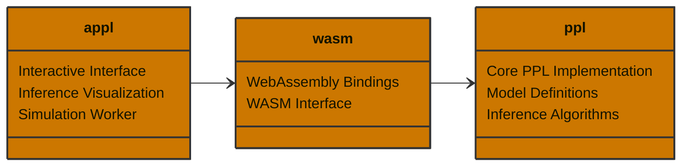

# SchemePPL

A mini probabilistic programming language that combines the elegance of Scheme's syntax with Bayesian inference capabilities. It allows you to define probabilistic models using a simple, Lisp-like syntax and perform inference using Markov Chain Monte Carlo (MCMC) methods.

In addition, there is an application for visualizing the inference process of a Random Walk Metropolis-Hastings algorithm:

- https://appl-ten.vercel.app

## Features

- Scheme-like DSL for model specification
- Built-in support for basic probability distributions
- MCMC-based inference (Random Walk Metropolis-Hastings)
- Support for mixture models and complex probabilistic relationships
- Web-based interface for model visualization and interaction

## Example

Here's an example of a Gaussian mixture model implemented in schemeppl:

```rust
use std::collections::HashMap;
use std::collections::HashSet;

use rand::distributions::{Bernoulli, Distribution};
use rand::rngs::StdRng;
use rand::SeedableRng;
use statrs::distribution::Normal;

use ppl::utils::compute_mean_and_variance;
use ppl::{mh, r#gen, GenerativeFunction, Value};

// Constants
const DATA_SEED: u64 = 40;
const SEED: u64 = 42;
const BURN_IN: usize = 100;
const DRAW: usize = 1000;
const PROPOSAL_SD: f64 = 0.15;
const NUM_SAMPLES: usize = 500;

// Run the inference for a univariate GMM model
fn main() {
    // Generate data
    let mut rng = StdRng::seed_from_u64(DATA_SEED);

    let p = 0.5;
    let (mu1, mu2) = (-2.0, 2.0);
    let sigma = 1.0;

    let z_dist = Bernoulli::new(p).unwrap();
    let z: Vec<bool> = (0..NUM_SAMPLES).map(|_| z_dist.sample(&mut rng)).collect();

    let component1 = Normal::new(mu1, sigma).unwrap();
    let c1: Vec<f64> = (0..NUM_SAMPLES)
        .map(|_| component1.sample(&mut rng))
        .collect();

    let component2 = Normal::new(mu2, sigma).unwrap();
    let c2: Vec<f64> = (0..NUM_SAMPLES)
        .map(|_| component2.sample(&mut rng))
        .collect();

    let data = Value::List(
        (0..NUM_SAMPLES)
            .map(|i| if z[i] { c1[i] } else { c2[i] })
            .into_iter()
            .map(|x| Value::Float(x))
            .collect(),
    );

    // Model Specification
    let model = gen!(
        // Priors
        (sample mu1 (normal 0.0 1.0))
        (sample mu2 (normal 0.0 1.0))

        // Ordering
        (constrain (< mu1 mu2))

        // Mixture
        (define p 0.5)
        (define mix (mixture (list (normal mu1 1.0) (normal mu2 1.0)) (list p (- 1.0 p))))

        (define observe-point (lambda (x) (observe (gensym) mix x)))

        (for-each observe-point data)
    );

    // Run inference
    let mu1_name = "mu1".to_string();
    let mu2_name = "mu2".to_string();

    let mut scales = HashMap::new();
    scales.insert(mu1_name.clone(), PROPOSAL_SD);
    scales.insert(mu2_name.clone(), PROPOSAL_SD);

    let program = GenerativeFunction::new(model, vec!["data".to_string()], scales, SEED);

    // Burn-in
    let selection = HashSet::from_iter(vec![mu1_name.clone(), mu2_name.clone()]);
    let mut trace = program.simulate(vec![data]).unwrap();
    for _ in 0..BURN_IN {
        let (t, _) = mh(&program, trace, &selection).unwrap();
        trace = t;
    }

    // Draw samples
    let mut history = Vec::with_capacity(DRAW);
    let mut num_accepted = 0u32;

    for _ in 0..DRAW {
        let (t, accepted) = mh(&program, trace, &selection).unwrap();
        trace = t;
        if accepted {
            num_accepted += 1;
        }
        history.push(trace.clone());
    }
    // Compute sample means and variances
    let (mean_mu1, variance_mu1) = compute_mean_and_variance(&history, &mu1_name);
    let (mean_mu2, variance_mu2) = compute_mean_and_variance(&history, &mu2_name);
    println!("mu1: {:.2} (var: {:.2})", mean_mu1, variance_mu1);
    println!("mu2: {:.2} (var: {:.2})", mean_mu2, variance_mu2);

    // Diagnostics
    let acceptance_rate = num_accepted as f64 / DRAW as f64;
    println!("Acceptance rate: {}", acceptance_rate);
}

```

This example demonstrates:

- Prior specification using `sample`
- Constraints on parameters using `constrain`
- Mixture model definition
- Data observation using `observe`
- Functional programming constructs like `lambda` and `for-each`

## Project Structure



## Limitations

- **Limited Distribution Support**: Currently only supports basic probability distributions (normal, bernoulli, exponential)
- **Basic Inference**: Only implements Random Walk Metropolis-Hastings, missing more advanced inference methods like HMC, NUTS, or variational inference
- **No Automatic Differentiation**: Cannot handle models that require gradient-based inference methods
- **No Parallel Inference**: Inference is performed sequentially, no support for parallel MCMC chains or distributed computation
- **No Recursive Functions**: Cannot define or use recursive functions in model definitions
- **No Nested Generative Functions**: Cannot define or use generative functions inside other generative functions

## References

- [Church](https://cocolab.stanford.edu/papers/GoodmanEtAl2008-UncertaintyInArtificialIntelligence.pdf)
- [Venture](https://arxiv.org/abs/1404.0099)
- [Anglican](https://arxiv.org/abs/1608.05263)
