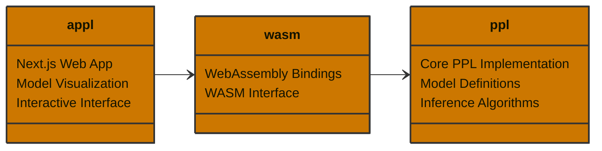

# schemeppl

A probabilistic programming language that utilizes a scheme-like DSL for Bayesian inference and probabilistic modeling.

Application: [appl-ten.vercel.app](https://appl-ten.vercel.app/)

## Overview

schemeppl is a probabilistic programming language that combines the elegance of Scheme's syntax with powerful Bayesian inference capabilities. It allows you to define probabilistic models using a simple, Lisp-like syntax and perform inference using Markov Chain Monte Carlo (MCMC) methods.

## Features

- Scheme-like DSL for model specification
- Built-in support for common probability distributions
- MCMC-based inference (Random Walk Metropolis-Hastings)
- Support for mixture models and complex probabilistic relationships
- Web-based interface for model visualization and interaction

## Example

Here's an example of a Gaussian mixture model implemented in schemeppl:

```rust
// Define a mixture model with two Gaussian components
let model = gen!(
    // Priors for the means of both components
    (sample mu1 (normal 0.0 1.0))
    (sample mu2 (normal 0.0 1.0))

    // Constrain mu1 to be less than mu2
    (constrain (< mu1 mu2))

    // Define the mixture model
    (define p 0.5)
    (define mix (mixture (list (normal mu1 1.0) (normal mu2 1.0)) (list p (- 1.0 p))))

    // Define observation function
    (define observe-point (lambda (x) (observe (gensym) mix x)))

    // Observe the data points
    (for-each observe-point data)
);
```

This example demonstrates:
- Prior specification using `sample`
- Constraints on parameters using `constrain`
- Mixture model definition
- Data observation using `observe`
- Functional programming constructs like `lambda` and `for-each`

## Project Structure



## Limitations

- **Limited Distribution Support**: Currently only supports basic probability distributions (normal, bernoulli) and lacks support for more complex distributions
- **Basic Inference**: Only implements Random Walk Metropolis-Hastings, missing more advanced inference methods like HMC, NUTS, or variational inference
- **No Automatic Differentiation**: Cannot handle models that require gradient-based inference methods
- **Limited Constraint System**: Only supports simple inequality constraints, no support for complex logical constraints or custom constraint functions
- **No Parallel Inference**: Inference is performed sequentially, no support for parallel MCMC chains or distributed computation
- **Limited Memory Management**: No built-in support for handling large datasets or memory-efficient computation
- **Basic Error Handling**: Limited error reporting and debugging capabilities for model specification and inference
- **No Model Compilation**: Models are interpreted at runtime, no ahead-of-time compilation or optimization
- **No Recursive Functions**: Cannot define or use recursive functions in model definitions
- **No Nested Generative Functions**: Cannot define or use generative functions inside other generative functions

## References
- Church: https://cocolab.stanford.edu/papers/GoodmanEtAl2008-UncertaintyInArtificialIntelligence.pdf
